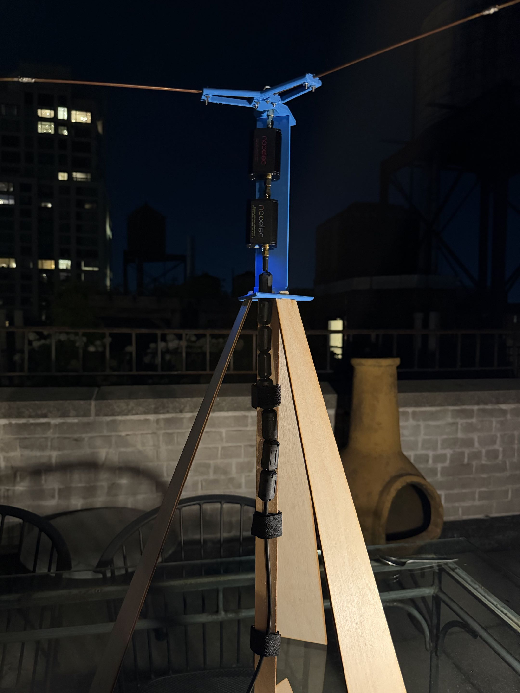
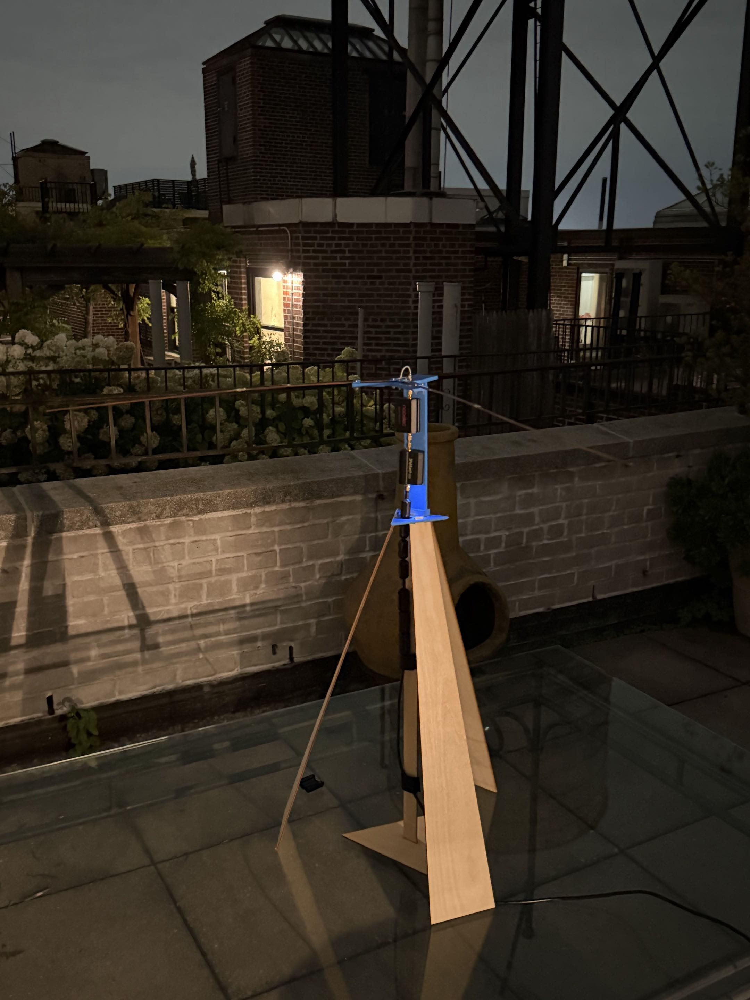
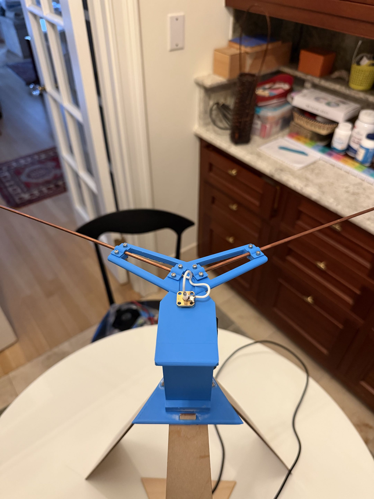
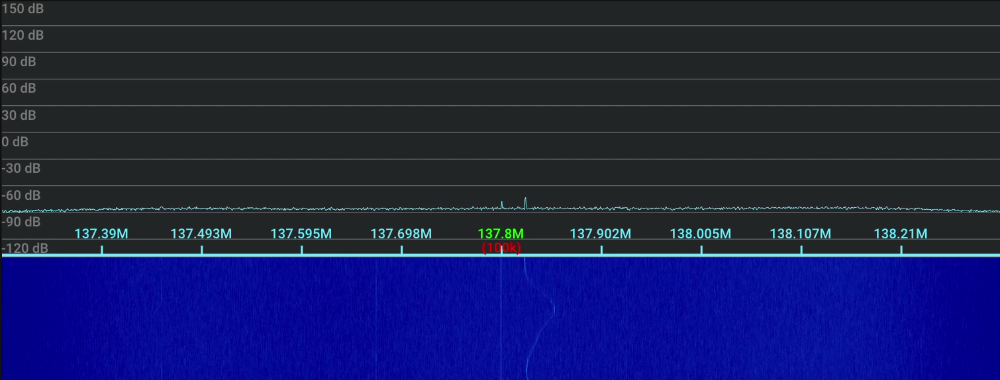

# Satellite SDR Receiver
A V-Dipole antenna designed for 137 MHz satellite signals, paired with an SDR to process them.

## Hardware
* Two copper rods, 54.5 cm long, 3mm outer diameter, 0.25mm wall thickness
* NooElec NESDR Smartee V2 (RTL-SDR)
* NooElec SAWbird+ NOAA (band-pass filter + LNA)
* NooElec Flamingo+ FM Notch Filter
* Two SMA male-to-male jacks
* 50-ohm SMA female panel mount connector
* RG-58, 7 mm ferrite chokes
* 3D-printed stand, PLA
* Fasteners for rod and stand assembly
* Laser-cut tripod, 3mm plywood

## Photos

  
  

  

## Design
### Antenna elements
* The copper rods are 54.5 cm long, which is approximately a quarter-wavelength at 137 MHZ.
* The rods are arranged at 120° to form the V-dipole geometry, providing a broad radiation pattern suitable for receiving satellite signals.
* The rods are soldered to the panel mount connector with 2-inch stranded wire to allow for frequent transport and reduce mechanical stress on the solder joints.
### RF Chain
* The RF chain was designed to reduce interference. The FM notch filter is placed closest to the feedpoint to attenuate FM signals, followed by the SAWbird+ to provide additional filtering and increase gain.
* The RG-58 is routed perpendicularly to the rod plane for >2 ft to reduce unintended coupling with the antenna. Ferrite chokes were placed on the RG-58 to attenuate common-mode current.
### Stand and Tripod
* The stand is modular to allow for easy transport and removal of the antenna elements, and ensures proper rod geometry.
* The entire assembly is roughly 2.5 feet tall to reduce the risk of the antenna interacting with the ground while permitting portability.

## Workflow
1. The rods are fastened into the stand's top piece with clamps and fasteners. The panel mount connector is positioned in the central hole.
2. The stand's top piece slots into the middle piece, then the middle piece into the tripod with dovetail mounts.
3. The Flamingo+ is attached to the panel mount connector with a male-to-male jack.
4. The SAWbird+ is attached to the Flamingo+ with a male-to-male jack.
5. The RG-58 is connected to the SAWbird+ through the tripod's center hole and strapped to its central piece.
6. Ferrite chokes are added to the RG-58, adjacent to the SAWbird+.
7. The RG-58 is screwed into the RTL-SDR, which is plugged into a laptop.
8. Place the antenna as far as practically possible from metal objects with a clear sightline of the sky. Move the laptop as far away as practical to reduce local interference.
9. Orient the antenna's apex along the satellite's expected pass direction, with the rod plane parallel to the ground. 
10. Use SDR software to listen for signals, or SatDump to track satellites and process signals.

## Signal Reception
My system observed a signal consistent with an ORBCOMM passover at 137.8 MHz, as seen next to the DC spike. The waterfall demonstrates the signal's Doppler shift as the satellite moved.

  

## Future Improvements
1. Test the antenna in a less RF-dense environment to determine if interference limited signal detection. The system was operated in Manhattan, which presents significant RF interference relative to less urban locations.
2. Increase the antenna's height and distance from nearby metal objects. The primary testing location contained metal railings, furniture, and reinforced concrete that may have altered the antenna's impedance and radiation pattern.
